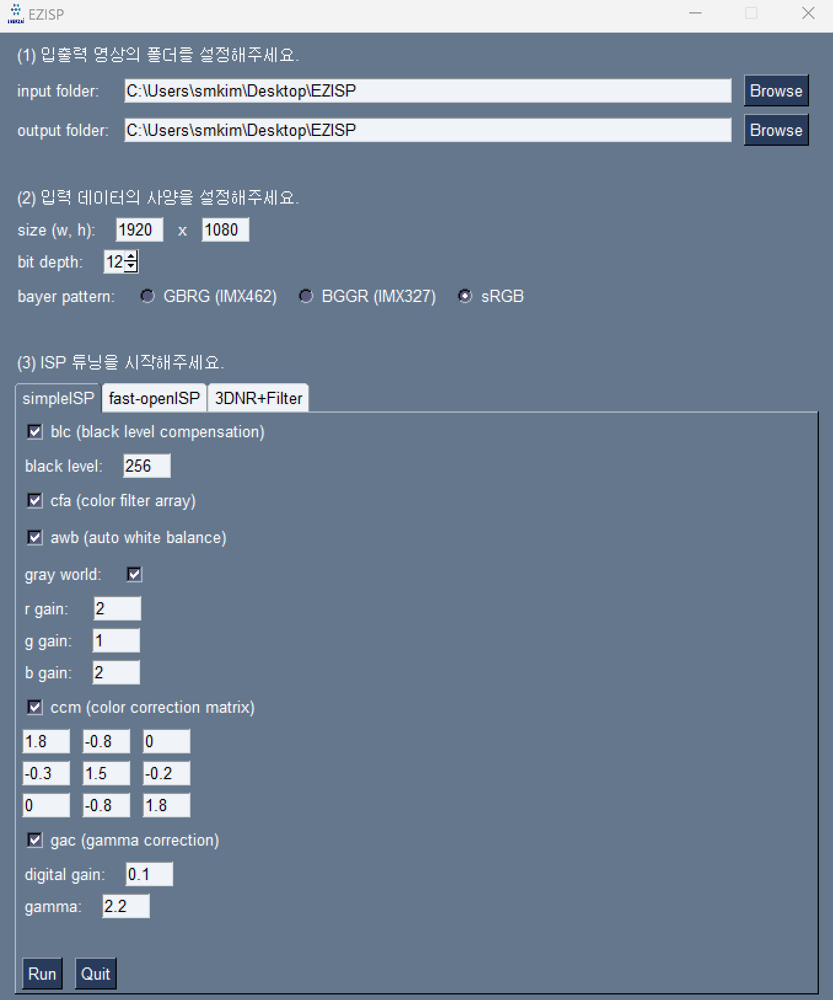
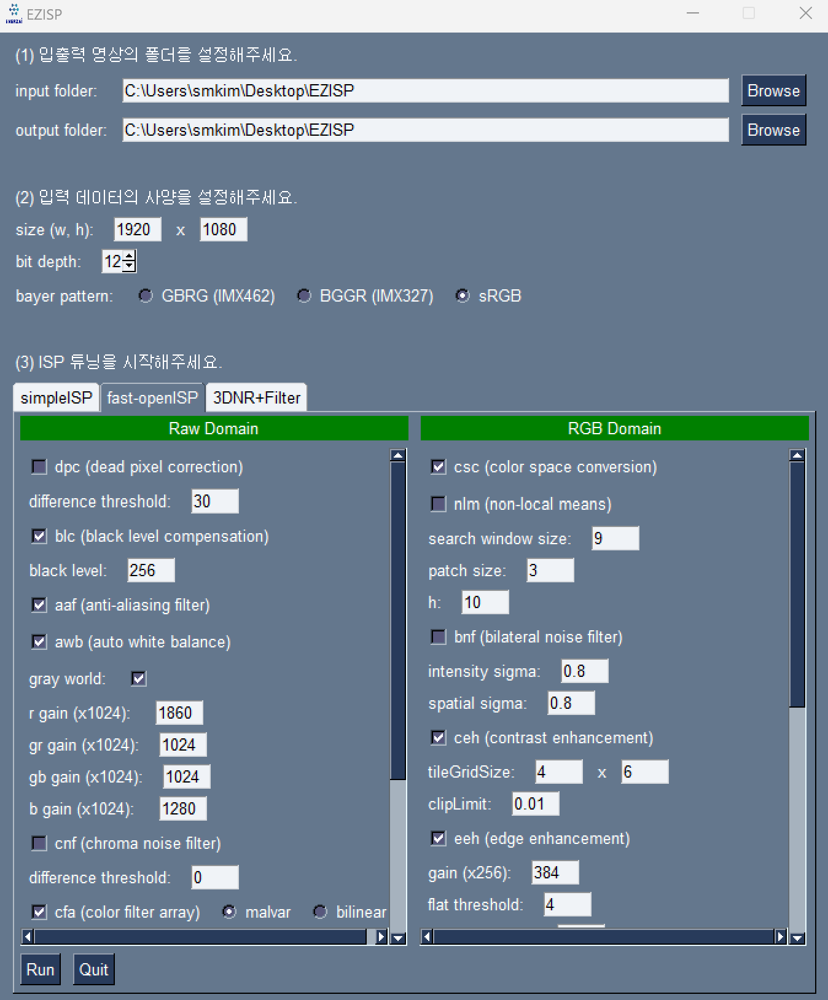
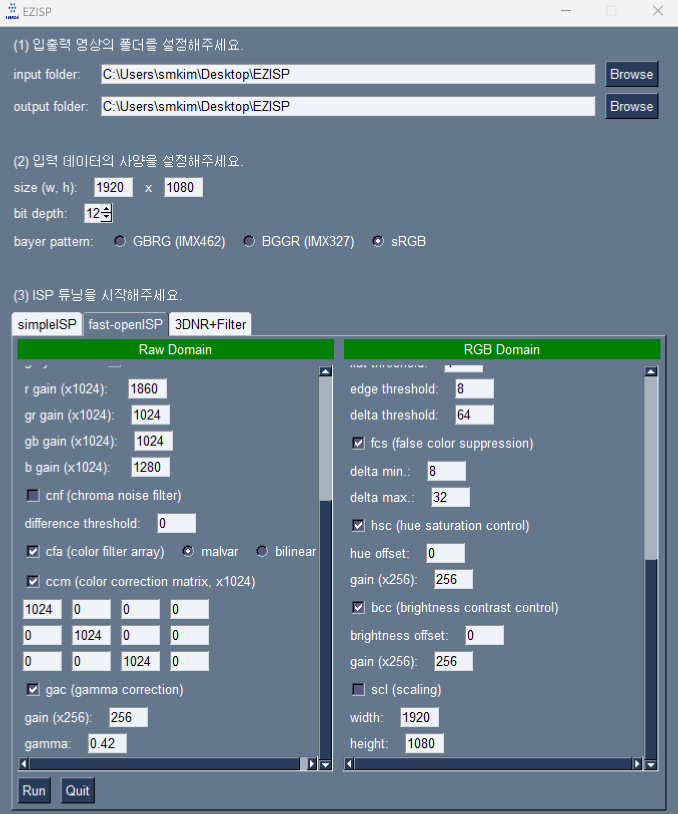
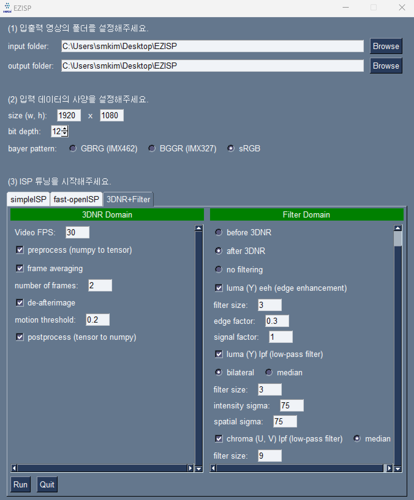

# EasyISP
ENERZAi ISP Tool
## Prerequisites
```
pip install -e .
```
## Run
```
python EasyISP.py
```

## UI
### EasyISP
- easy pipeline by ENERZAi Raw2RGB Team


### fast-openISP
- [Reference](https://github.com/QiuJueqin/fast-openISP/tree/master)



### 3DNR+Filter
- Postprocessing for denoised results by ENERZAi Raw2RGB Team

   
