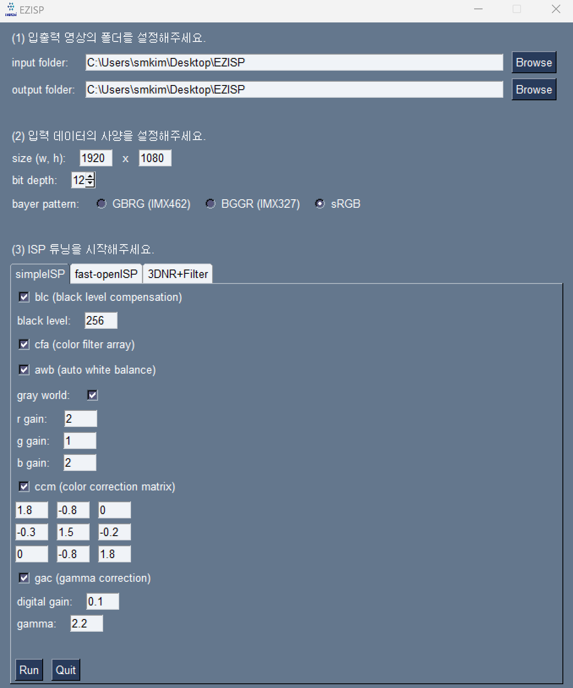
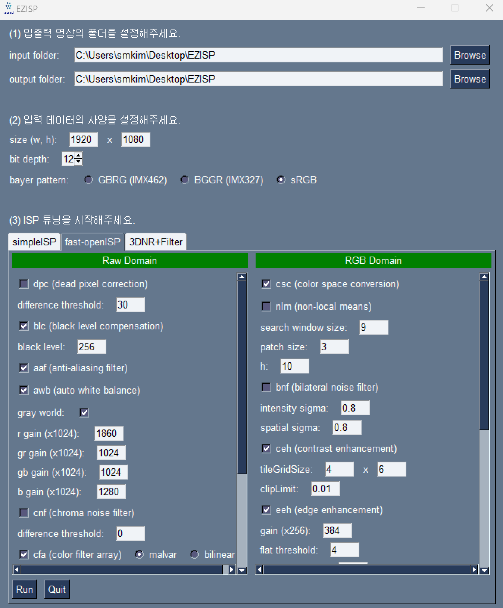
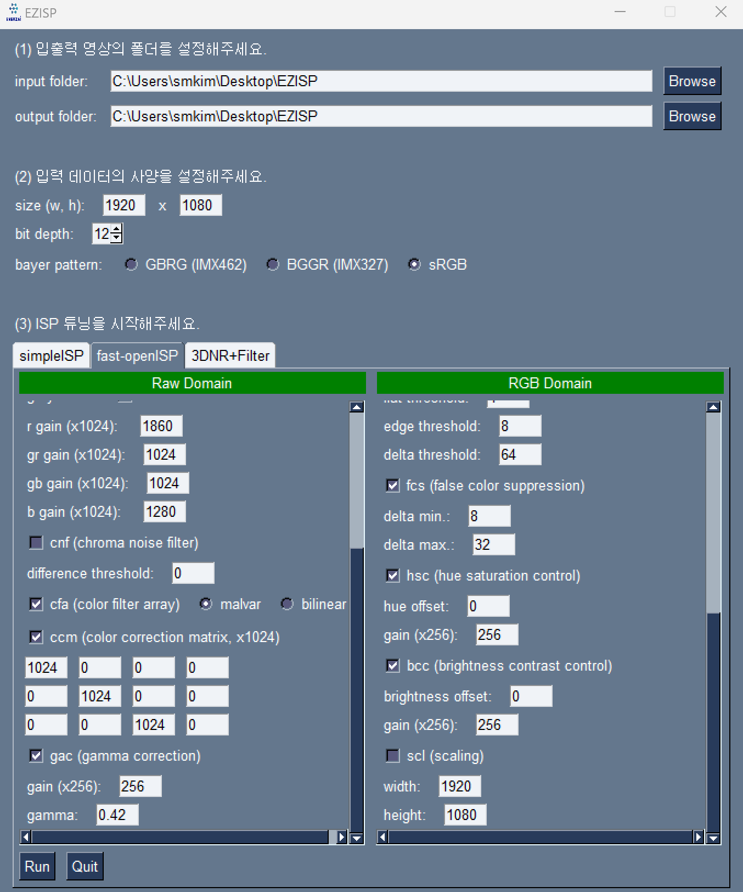
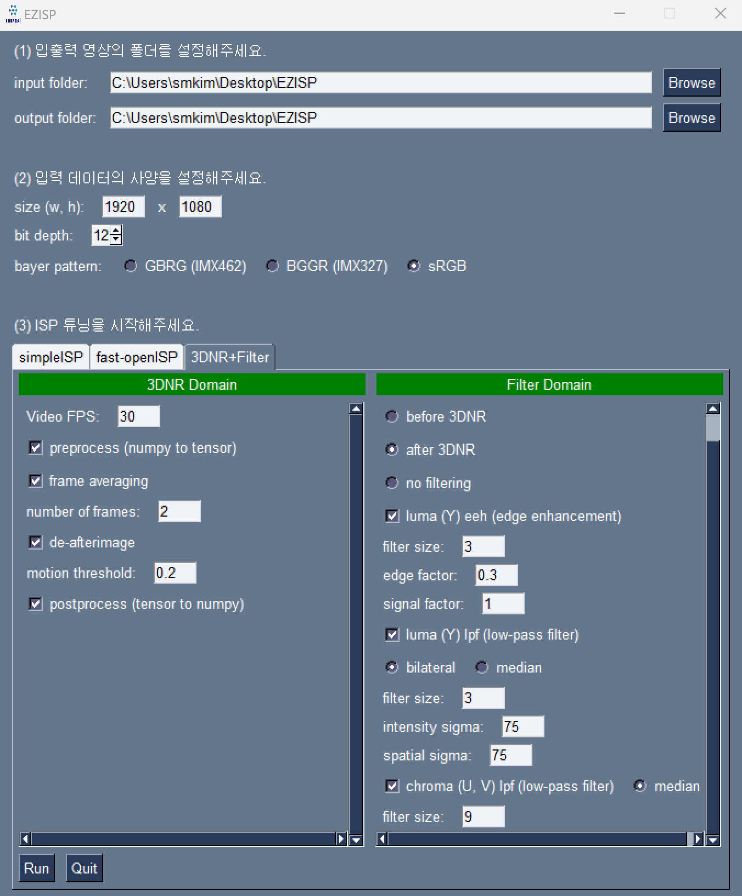

# EasyISP — GUI Image Signal Processor for RAW Post-processing

> Developed with the **ENERZAi Raw2RGB Team**.

A Windows GUI tool that converts sensor RAW images to RGB with an adjustable ISP pipeline — built to tune and compare low-light denoising results.

## ✨ Features
- Step-by-step ISP: **Demosaicing → AWB → CCM** and more, each parameter adjustable in the UI
- **3DNR + filter** post-processing for denoised outputs
- Config-based presets (`configs/`)

## 🚀 Run
```bash
pip install -e .
python EasyISP.py        # or double-click EasyISP.bat on Windows
```

## 🖥 Screenshots
**EasyISP pipeline**



**fast-openISP mode**




**3DNR + Filter post-processing**



## Reference
Built on [fast-openISP](https://github.com/QiuJueqin/fast-openISP).

## Related
[EasyCapture](https://github.com/bmycheez/EasyCapture) · [EasyDemo](https://github.com/bmycheez/EasyDemo)
